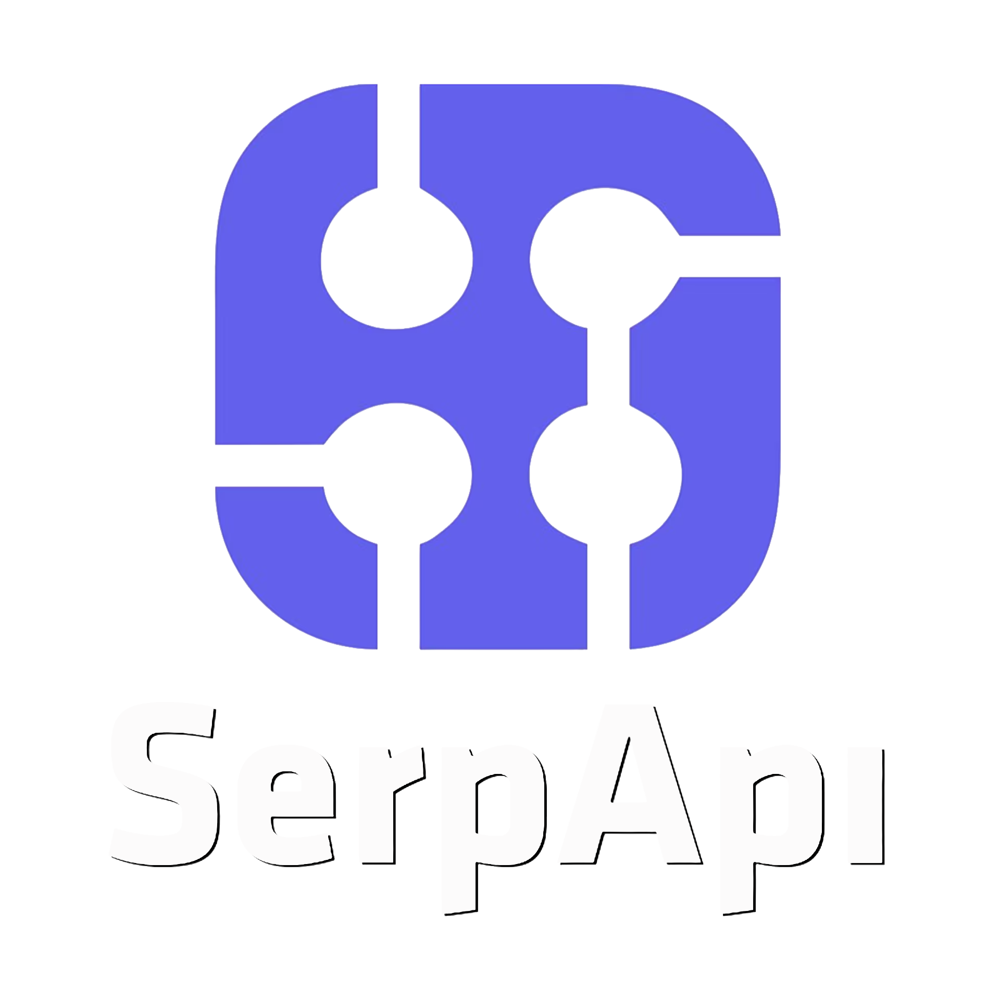

# 🛠️ SQL for Data Engineering - Full Course

### [Projects](Projects/)

- [**Project #1:** Exploratory Data Analysis](Projects/1_EDA/) — Job market analytics with SQL
- [**Project #2:** Data Warehouse & Mart Build](Projects/2_WH_Mart_Build/) — Production ETL pipeline from raw CSVs to star schema and data marts
- [**Project #3:** Flat to Warehouse Build](Projects/3_Flat_to_WH_Build/) — Transform flat job posting data into a normalized star schema *(bonus project, not covered in video)*

## How to Run SQL

### Option 1: Cloud (Easiest to get started) — MotherDuck

1. **Sign up for MotherDuck** (free): [lukeb.co/motherduck](https://lukeb.co/motherduck)
2. Use **MotherDuck Studio** in your browser — no installation required
3. **Attach the course database** by running this command:

```sql
ATTACH 'md:_share/data_jobs/87603155-cdc7-4c80-85ad-3a6b0d760d93'
```

4. **For running project files:** Not recommended — the cloud UI works like a Jupyter notebook (run queries cell-by-cell; no direct file execution). Best for ad hoc analysis. To run full project files, use Option 2 below.

### Option 2: Run Locally with DuckDB

1. **Install DuckDB** from the [official MotherDuck install page](https://motherduck.com/docs/getting-started/interfaces/connect-query-from-duckdb-cli/) — follow the instructions for your OS to install the correct version that supports MotherDuck.

2. **Launch DuckDB** in your terminal:

   ```bash
   duckdb
   ```

3. **Attach and connect to the course database** — either specify the database when launching DuckDB (`duckdb "md:data_jobs"`), or in your session run `ATTACH` then `USE` to switch to the attached database:

   ```sql
   ATTACH 'md:_share/data_jobs/87603155-cdc7-4c80-85ad-3a6b0d760d93';
   USE data_jobs;
   ```

4. **For running project files:** Follow the instructions outlined in each [project section](Projects/).

## Found a Typo? Want to Contribute?
- If you find an error in this repo, please feel free to make a pull request by:
    - Forking the repo
    - Making any changes
    - Submitting a pull request

## Special Thanks 🙌

<div style="width:25%; margin:auto;">
  
</div>

A special thanks to [SerpApi](https://serpapi.com/), whose generous credits made it possible to gather the job postings data used in this course.
